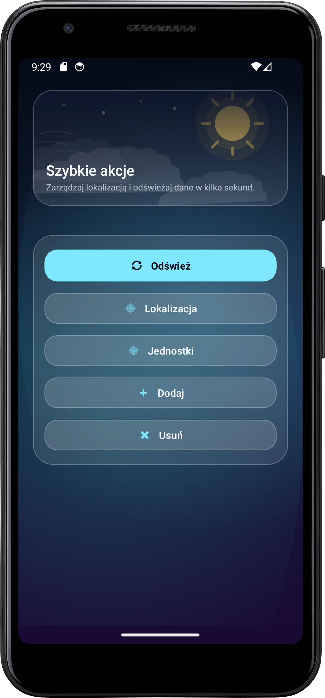
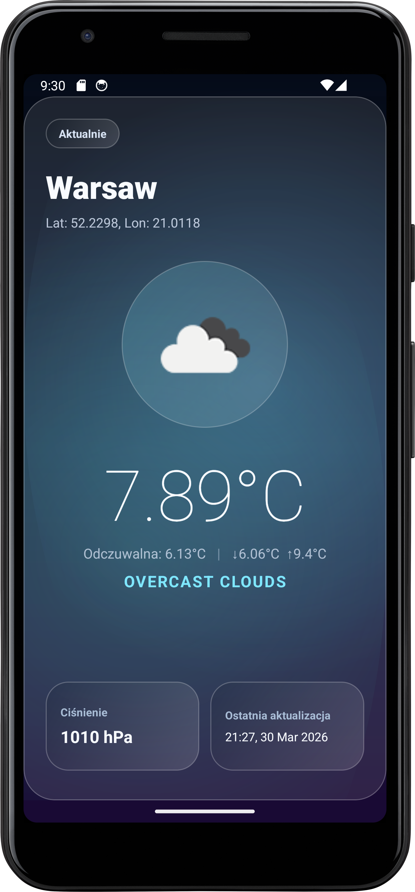
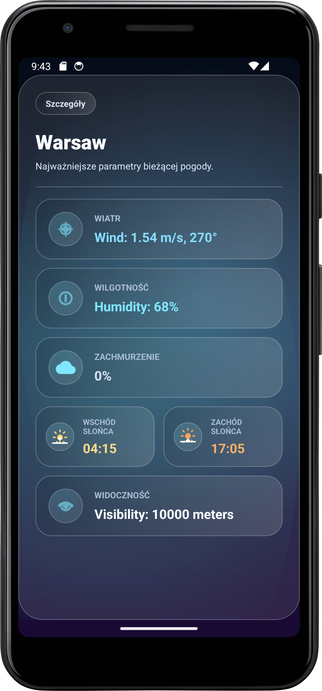
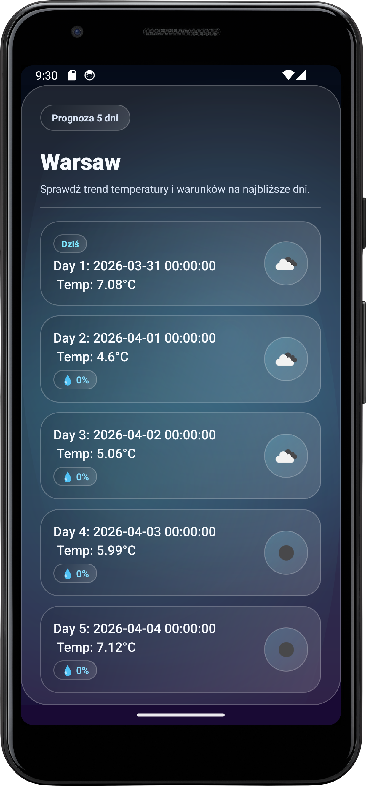

# WeartherApp

**WeartherApp** is an Android weather app built with Kotlin.  
It shows current weather, detailed conditions, and a 5-day forecast, with support for phone and tablet layouts.  
The app also stores preferences and cached data for better offline experience. The app integrates with **OpenWeatherMap API** via **Retrofit**.

## Features
- **Current weather** view (temperature, feels-like, min/max, pressure, description, icon)
- **Details** view (wind, humidity, visibility, clouds, sunrise, sunset)
- **5-day forecast** with icons, temperature, and precipitation probability
- **Location management**: search, select, add, and remove favorite locations
- **Unit switching** between metric and imperial
- **Manual and periodic refresh** with offline cached fallback

## Tech Stack
- **Kotlin**
- **Android SDK** (minSdk 32, targetSdk 34)
- **AndroidX** (Fragments, ViewPager2, Lifecycle, ConstraintLayout)
- **Material Components**
- **Retrofit2** + **Gson**
- **LiveData** + **ViewModel**
- **Picasso**

## Project Structure
- `app/` - Android application module
- `app/src/main/java/com/example/pogodaa/` - Fragments, ViewModel, API client, models, app settings
- `app/src/main/res/layout/` - UI layouts
- `app/src/main/res/drawable/` - Custom backgrounds and drawable assets
- `app/src/main/res/values/` - Colors, strings, and theme resources
- `gradle/libs.versions.toml` - Dependency and plugin versions
- `app/build.gradle.kts` - App-level build configuration

## Screenshots Portrait
<table>
  <tr>
    <th>Main Fragment</th>
    <th>Weather Fragment</th>
    <th>Details Fragment</th>
    <th>Forecast Fragment</th>
  </tr>
  <tr>
    <td></td>
    <td></td>
    <td></td>
    <td></td>
  </tr>
</table>

## Getting Started
1. Clone the repository.
2. Open in Android Studio.
3. Sync Gradle dependencies.
4. Set your OpenWeather API key in `app/src/main/java/com/example/pogodaa/AppSettings.kt`.
5. Run on an emulator or Android device (API 32+).

## Learning Goals
- Building a multi-screen Android app with shared **ViewModel** state
- Integrating REST APIs using **Retrofit** and **Gson**
- Handling online/offline scenarios with local caching
- Creating adaptive UI for orientation and device size differences
- Structuring Android code with clear separation of UI and data flow
